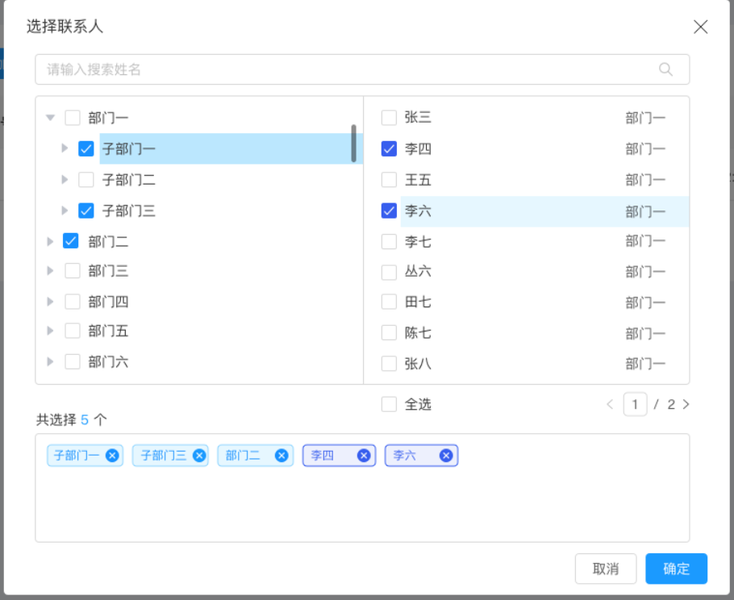

# react-contacts
contacts  &amp; department select

[中文文档](https://github.com/wafersystems/react-contacts/blob/master/README_zh.md)

威发微服务选人组件/Wafer microservice selection component

[](https://github.com/wafersystems/react-contacts)
[](https://www.npmjs.com/package/react-contacts)
[](https://www.npmjs.com/package/react-contacts)

## Example



## How to use

### install

`yarn add react-contacts`

### React 

```js
import Contacts from 'react-contacts'

<Contacts {...props}/>

```

Properties  | Description | Type | Default Values
------------- | ------------- | --------------| ------------- 
deptTree  | Department of Tree（[Department Data](###Department Data)） | array | []
users  | User data （[User & Search Result Data](###User & Search Result Data)） | object | { records: []}
loading | Loading status | bool | false
searchResult | Query user data return results （[User & Search Result Data](###User & Search Result Data)） | object | { records: []}
handleSearchUser | Handle search user function | func | function(page,nameKey,depId)
deptSearch | Show department search input | bool | tree
updateSelectUsers | Update user list when select user | func | function(userSelected)
updateSelectDept | Update dept list when select dept | func | function(deptSelected)
deptCheckBox | Show department checkbox | bool | true
searchDeptPlaceholder | search department placeholder | string | '请输入搜索部门'
searchUserPlaceholder | search department placeholder | string | '请输入搜索姓名'
defaultUserSelected   | default user selected | array | [{userId:'abc',username:'CCC'}] 
defaultDeptSelected   | default user selected ([Note](###Department tree initialization data)) | array | [{id:1,name:'ABC'}] 
numberColor   | total number color | sring | #1B9AFF 
selectAllText   | select all text | string | 全选 
totalShowText   | totalShowText | string | 共选择了$个
userNameKey | fetch user name and selected key | string | 'username'
deptNameKey | Take the department tree and select the name of the key | string | 'name' 
radio   | show radio on user selected | bool | false
radioShowText   | when user selected on radio, show tip text. | string | '已经选择' 
checkStrictly   | 	Check treeNode precisely; parent treeNode and children treeNodes are not associated | bool | false
showAllDeptTags   | Whether Tags show all nodes | bool | false
returnReducedNode | Department tree data reduction mode ([Department tree initialization data](###Department tree initialization data)) | bool | false
showLeft | show Left Panel | bool | true


### Department Data

````
[
      {
        id: 1,
        parentId: 0,
        children: [
          {
            id: 3,
            parentId: 1,
            children: [
              {
                id: 4,
                parentId: 3,
                children: [
                  {
                    id: 5,
                    parentId: 4,
                    children: [],
                    name: '院校农信',
                  },
                ],
                name: '高新农信',
              },
            ],
            name: '潍坊农信',
          },
        ],
        name: '山东农信',
      },
  ]
````

### User & Search Result Data

```

 {
      records: [
        {
          userId: 1,
          username: 'admin',
          password: '$2a$10$QOfWxxFyAMmEEmnuw9UI/..1s4B4eF/u9PzE2ZaGO.ij9YfmcUy.u',
          salt: null,
          wxOpenid: 'o_0FT0uyg_H1vVy2H0JpSwlVGhWQ',
          qqOpenid: null,
          createTime: '2018-04-20 07:15:18',
          updateTime: '2019-03-12 16:04:42',
          mail: 'a@a.com',
          delFlag: '0',
          lockFlag: '0',
          phone: '17034642888',
          avatar: 'lengleng-0d2a7b025da14d8d93f595b3fa082d82.jpg',
          deptId: 1,
          tenantId: 1,
          deptName: '真理部',
          roleList: [
            {
              roleId: 1,
              roleName: '管理员',
              roleCode: 'ROLE_ADMIN',
              roleDesc: '管理员',
              dsType: 2,
              dsScope: '2',
              createTime: '2017-10-29 15:45:51',
              updateTime: '2018-12-26 14:09:11',
              delFlag: '0',
            },
          ],
        },
	   ......
      ],
      total: 11,
      size: 10,
      current: 1,
      searchCount: true,
      pages: 1,
    },

```

###Department tree initialization data

returnReducedNode controls the data format of the department tree, true for simplified mode, false (default) for full data.

####Lean mode
If a node on the tree, its child nodes are all selected, the returned data only contains the parent node but not the child nodes

####Full mode
If a node on the tree, its child nodes are all selected, the returned data will contain the parent node and child nodes

####Initialize the department tree
If the initial data cannot contain the relationship between parent and child nodes, the department tree will appear out of sync when deleting with tag. Solution:

1. When saving data, please save the complete data, do not delete the content in children.

2. The use of reduced mode data may affect the background calculation.

Choose one of the above methods.

### Development

````
$ git clone https://github.com/wafersystems/react-contacts.git
$ yarn
$ yarn start

````
